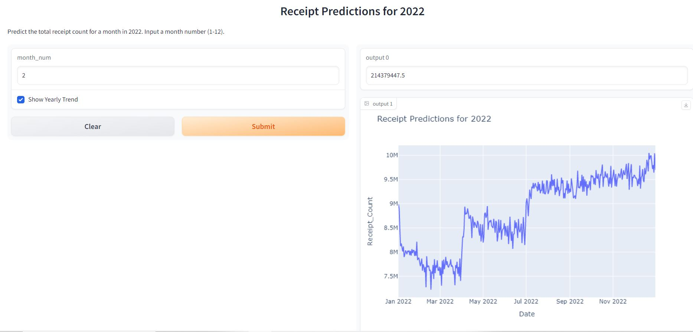

# Fetch-Hiring-Machine-Learning-Engineer

### Project Overview:

**1. Data Analysis and Preprocessing:** 
- Examined the provided data and conducted preliminary analysis.
- Processed the data to make it suitable for modeling.

**2. Model Exploration and Evaluation:** 
- Explored several models including Prophet, GRU, Linear Regression, and others.
- Found that XGBoost provided the best results, achieving an MAPE (Mean Absolute Percentage Error) of 4.8%.

**3. Gradio Interface Implementation:** 
- Developed a Gradio interface for the XGBoost model to allow users to interact with it through a web-based GUI.

**4. Docker Integration:** 
- Packaged the Gradio application and all its dependencies into a Docker container for easy deployment and scalability.

---

### Instructions for Running the Project:

**Using Docker:**
1. **Building the Docker Container Locally:**
   - Navigate to the project directory.
   - Run the following command: `docker build -t gradio_app .`

2. **Running the Docker Container Locally:**
   - After building, run the container using the command: `docker run -p 7860:7860 gradio_app`
   - Open a web browser and go to `http://localhost:7860` to interact with the Gradio interface.

**Without Docker (Running Directly):**
1. **Setting up the Environment:**
   - Ensure Python is installed.
   - Navigate to the project directory.
   - Install the necessary libraries using the command: `pip install -r requirements.txt`

2. **Running the Application:**
   - Execute the command: `python inference.py`
   - Open a web browser and go to the displayed URL to interact with the Gradio interface.

**Pushing to Docker Hub (Optional, if needed in the future):**
1. Create a Docker Hub account if you don't have one.
2. Log in to Docker from the command line: `docker login`
3. Tag your image: `docker tag gradio_app <username>/gradio_app:latest`
4. Push the image to Docker Hub: `docker push <username>/gradio_app:latest`

## Features of the Gradio Interface:

Date Selection: Users can select a specific date for which they want to predict sales.

Yearly Trend Option: If users want to observe the overall trend of sales throughout the year, they can opt for this feature.

Interactive Plot: Once the forecast is generated, users can view the results in an interactive plotly graph. This plot shows the forecasted values, and if the yearly trend option is selected, the overall sales trend for the year.

Ease of Use: The interface is designed to be simple and intuitive. Users simply select their desired options and click on the "Predict" button to obtain the forecast.

Screenshot of the Interface:

